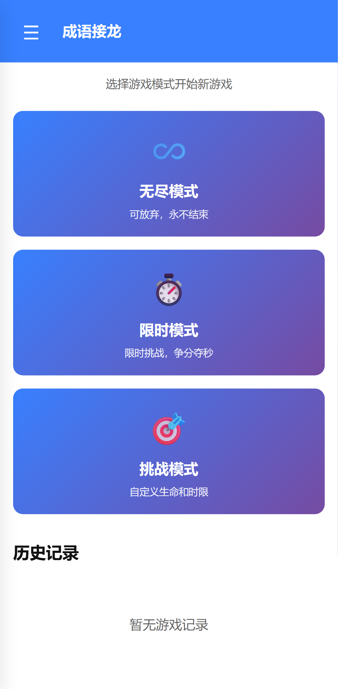
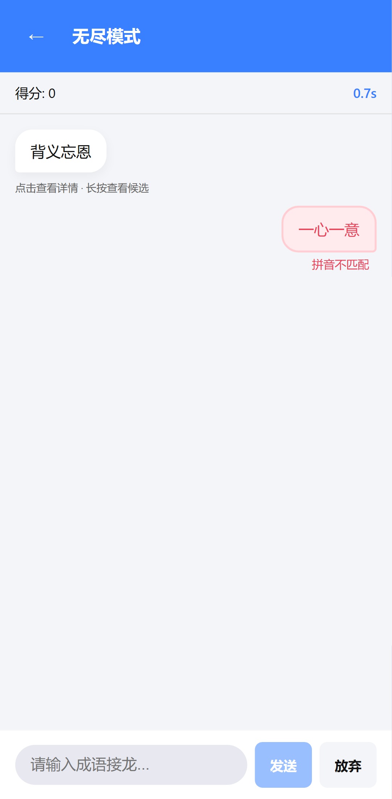
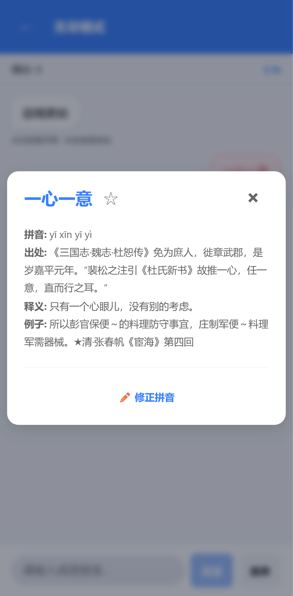
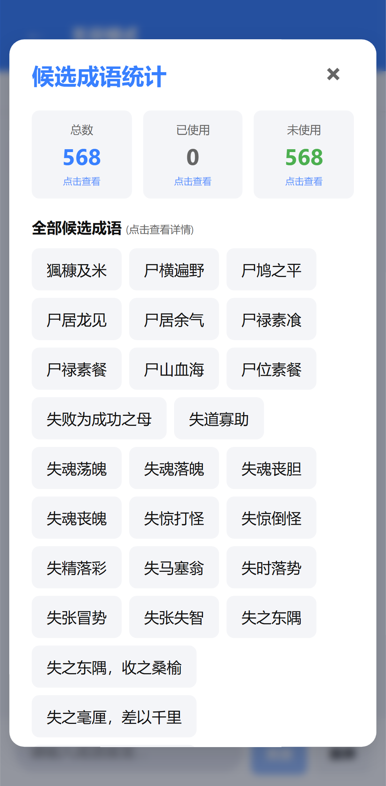
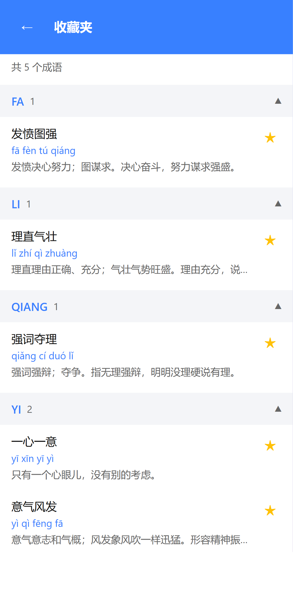
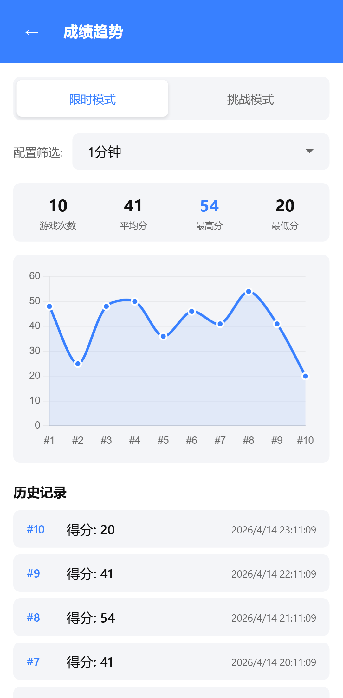
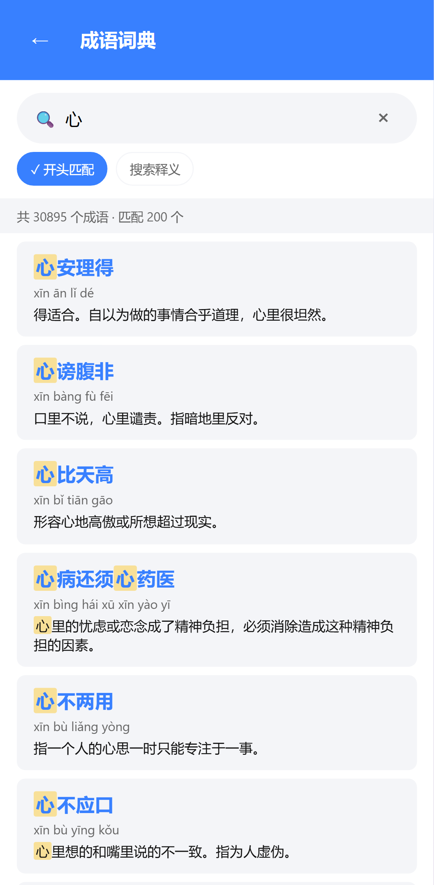

# 成语接龙 (Chengyu Jielong)

一款基于 Capacitor 的成语接龙游戏应用，支持 Android 和 Web 平台。

## 游戏简介

成语接龙是一款经典的中文文字游戏。玩家需要根据上一个成语的最后一个字的拼音，接出下一个成语。本应用支持与电脑对战，让你随时随地享受成语接龙的乐趣。

## 游戏规则

1. 游戏开始时，电脑会随机给出一个成语
2. 玩家需要输入一个成语，该成语的第一个字的拼音必须与上一个成语最后一个字的拼音相同
3. 每个成语只能使用一次
4. 电脑会轮流接龙
5. 当一方无法接出成语时，游戏结束

## 游戏模式

### 无尽模式
挑战自己的极限，看看你能接出多少个成语！

### 限时模式
在限定时间内尽可能多地接龙，挑战最高分！

### 挑战模式
每轮有时间限制，失误会扣除生命值，看看你能坚持多久！

## 主要功能

### 成语详情
点击任意成语可以查看详细信息，包括拼音、出处、释义和例句。

### 候选成语
长按电脑回复的成语气泡，可以查看所有可能的候选成语，帮助你找到合适的接龙。

### 收藏夹
遇到喜欢的成语？点击详情页的星星图标将其收藏！收藏的成语会按首字母拼音分组显示。

### 成绩趋势
查看你的游戏成绩变化趋势，了解自己的进步情况。

### 成语词典
内置成语词典功能，支持搜索和浏览所有成语。

## 界面预览

### 侧边菜单
通过侧边菜单可以快速访问各种功能。

## 安装与使用

### Web 版本
直接在浏览器中打开即可使用。

### Android 版本
1. 下载 APK 安装包
2. 安装到 Android 设备
3. 开始游戏！

## 技术栈

- TypeScript
- Vite
- Capacitor 6
- Playwright (测试)

## 数据来源

成语数据包含：
- 成语文本
- 拼音
- 出处
- 释义
- 例句

## 许可证

MIT
